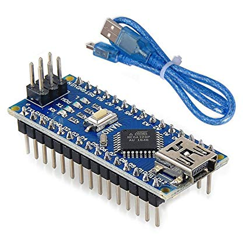

<h1>
	
 	Cleaning-Bot
	
</h1>

A microcontroller project to create a bot, which uses image processing, and machine learning to detect trash on the road, and clean it.(Contributions encouraged!)

## About The Project

Current status: Arduino code which activates bot motors when it detects the right colour.

## Architecture
Commit 1. Arduino connected to 2 motors and 1 colour sensor

## Usage
Detect trash on the road, and clean it

### Hardware usage
1. Arduino nano
2. R-pi 3
3. Motor driver
4. Colour sensor module
5. Camera
6. 4 motors - 4 wheels
7. Chasis
8. Rechargable 9V batteries

## Current TODO

Mounting and Testing
